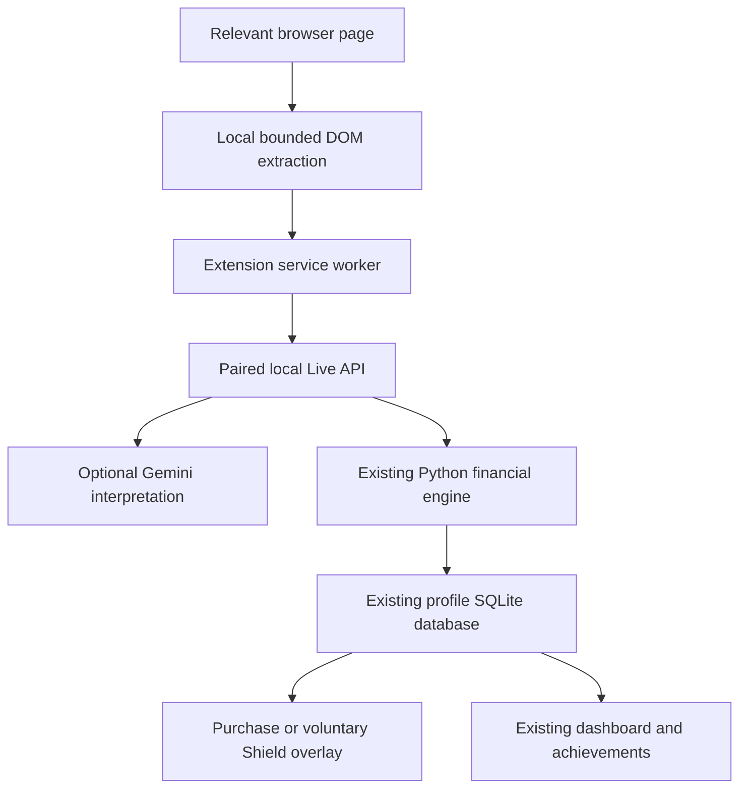

# SpendShield Live

Budgeting apps tell you where your money went. SpendShield helps before it leaves.

## What is included

A Manifest V3 Chrome extension brings the existing budget, goal scenarios, Money Rescued decisions and Gambling Guard to relevant pages. Ordinary browsing stays quiet. A small bottom-right widget expands only when requested; voluntary Shield Mode can cover a detected gambling page.

- Product/cart/checkout detection from JSON-LD, product metadata, headings, price labels and purchase buttons. Query strings and URL fragments are discarded. Prices are confirmed before decisions.
- Purchase tradeoffs use the existing Python financial engine: remaining budget, percentage, baseline goal timing and purchase-delay scenario.
- Protect a purchase, enter a verified cheaper alternative, or wait 1–168 hours (24 by default). Reopening the same URL/product/price retrieves its saved decision and waiting period.
- Demo-only fictional $119 headphones produce a deterministic $60 difference from $179. Personal profiles require a user-entered, verified alternative. The Google search link is a search, not live-price verification.
- Gambling Guard uses recorded transactions and the weekly limit from the main app. Enter a hypothetical amount in the overlay; the extension never reads wager/payment form values.
- Shield Mode is off by default. Enable it to cover detected gambling pages during a cooldown and/or at the recorded weekly limit. It makes the underlying page inert while covered. A cached active cooldown can keep that cover in place offline. Disable it in settings; disabling the extension in Chrome always remains possible.
- The popup shows this month's Money Rescued, goal progress, available discretionary budget, Guard and Shield status, with quick controls.
- Five new badges join My Plan's collection: First Shield, Smart Swap, Goal Guardian, Room to decide, and A safeguard chosen. These recognize recorded actions, not verified savings or recovery.

## Run from the Windows download

1. Extract the entire SpendShield-Windows ZIP. Keep it in a stable folder; do not run inside the ZIP.
2. Double-click **OPEN SpendShield.cmd**. For a stable extension connection use **OPEN SpendShield Live.cmd**, which uses port 8000. Close another instance first. Your existing personal database stays in the same data folder.
3. For the scripted judge presentation instead, double-click **START LIVE DEMO.cmd**. It resets only the fictional `app/data/live-demo.sqlite3` profile and runs on port 8002. Close its previous console before restarting. Your personal database is untouched.
4. Install and pair the extension as described below. No Python or Node installation is required for this download.

## Run from source (Windows PowerShell)

From the extracted `spendshield` directory, with Python 3.11+ and Node 20.19+ installed:

```powershell
python -m venv .venv
.\.venv\Scripts\python.exe -m pip install -r requirements-lock.txt
cd frontend
npx pnpm@11 install --frozen-lockfile
npx pnpm@11 run build
cd ..
node extension/build.mjs
.\.venv\Scripts\python.exe start.py
```

`start.py` serves the built frontend and Python API together at http://127.0.0.1:8000. Keep its terminal open. For frontend development, run `npx pnpm@11 run dev` in `frontend` in a second terminal; the configured Vite proxy targets port 8000.

To present the separate fictional profile, close any previous demo server and run:

```powershell
.\.venv\Scripts\python.exe launch_live_demo.py --reset
```

That serves both frontend and API at http://127.0.0.1:8002. `--reset` clears only the isolated demo profile and preserves the paired extension ID. Omit it to resume a previous demo. Re-run with reset before each scripted presentation so dates and totals match.

On macOS/Linux use `python3` and `.venv/bin/python`; Windows CMD launchers are Windows-only. The extension build uses Node's standard library, has no dependency install, and copies validated JavaScript/assets into `extension/dist`.

## Install Chrome extension

1. Open `chrome://extensions` in Chrome.
2. Turn on **Developer mode**.
3. Select **Load unpacked** and choose `extension/dist` inside the source folder, or `SpendShield-Live` inside the Windows download. In the standalone extension ZIP, select the extracted `SpendShield-Live` folder containing `manifest.json`.
4. Pin **SpendShield Live** using Chrome's extensions menu.
5. Open its **Connection & safeguards** page. Copy the displayed extension ID.
6. In the main app, open **My Plan → Pay & challenges → SpendShield Live**. Paste the ID into **Chrome extension ID**, choose your settings, and press **Save Live settings**.
7. Return to extension settings. Set Backend URL to `http://127.0.0.1:8000` for your personal app or `http://127.0.0.1:8002` for the demo. Press **Save connection and check**.
8. Refresh any already-open shopping pages. The popup should now say it is connected. The ID may change if you move the unpacked folder; pair it again if so.

The extension currently supports local loopback backends only. Hosted GitHub-sign-in deployments require a separate authenticated extension flow and are not supported by this release. An unpaired extension receives a clear connection error. Cross-origin website requests remain rejected; extension requests are limited to Live routes and the paired ID.

## Exact three-minute demo

Before presenting: launch the isolated demo with reset, pair the extension with port 8002, and open the dashboard, `/demo-sites/store.html` and `/demo-sites/sportsbook.html`. Gemini is unnecessary for these deterministic fixtures. Leave it off for a network-independent presentation.

**0:00–0:25 — Dashboard.** “Most budgeting tools tell you where your money went. SpendShield helps before it leaves.” Show the Emergency fund with $1,130 saved toward $1,500, $381 discretionary budget left, and $0 Money Rescued.

**0:25–1:20 — Fictional store.** Click the automatically appearing SpendShield widget. Confirm the $179 USD total with **Show my tradeoff**. Show 47% of remaining budget and the 9-day difference (28 days buying versus 19 days retaining the baseline). Select **Find a cheaper option → Demo headphones · $119 · protect $60**. The result says $60 protected, explicitly a tracked intention rather than a transfer.

**1:20–2:25 — Fictional sportsbook.** Open its SpendShield widget. Show $84 recorded against the $100 limit, $16 remaining, and the default $30 scenario exceeding the chosen limit by $14. Choose **Start 24-hour Shield Mode**. Reload: the page is covered because the user explicitly requested it. Choose **Put this amount toward my goal instead**. Show $30 protected.

**2:25–3:00 — Dashboard.** Return to the dashboard; focus refresh / five-second polling updates Money Rescued to $90 and protected intentions to $90. The goal shows $1,220 if these intentions are saved, while confirmed savings remain $1,130. Explain: “AI interprets when needed. Code calculates. The user stays in control. We track the decision; we never claim a bank transfer.” In Activity, Mark as saved is only for money actually set aside; do not pretend a real transfer occurred in the demo.

Optional extra: use `/demo-sites/checkout.html` to show cart detection and **Wait 24 hours**, then reload and reopen the check to see the persistent timer.

## Privacy and architecture



Permissions: `storage` remembers local backend / cached safeguards; `activeTab` supports an explicit page check. Content scripts match HTTP/HTTPS pages for local relevance detection. Network host permissions are restricted to localhost and 127.0.0.1. There is no cookie, password, history, payment or debugger permission. Test-only Chrome debugging is not part of the extension.

No Gemini key is bundled or stored in extension storage. All Gemini calls use the backend's private configuration and the main profile's AI opt-in. Deterministic extraction at confidence 0.85 or higher skips Gemini. Uncertain relevant context can use structured interpretation; unrelated pages are not sent unless the user requests a check. Automatic shopping interpretation is off by default. Context contains bounded titles/headings/price labels, not full HTML or form values. Emails and long number sequences are redacted as an additional precaution. The overlay uses a closed shadow root to avoid exposing its financial text to ordinary page DOM queries, text-only rendering for untrusted strings, and no remote scripts.

State lives in the existing `settings`, `purchases`, and `events` tables. The extension stores a recent safeguard/summary snapshot locally for offline handling, not API credentials. Purchase actions reuse the original protection handler; timers reuse the existing check planner. Money Rescued remains distinct from confirmed savings. Activity's existing correction/undo tools apply.

## Important files

- `backend/live.py`: typed local companion API, bounded classification, extension settings, engine/decision adapters.
- `backend/main.py`: Live router, paired extension origin handling, demo-page mount.
- `backend/planning.py`: five Live achievement definitions.
- `frontend/src/LiveSettings.tsx`, `MyPlan.tsx`, `App.tsx`: pairing/safeguards, achievement links, dashboard synchronization.
- `extension/manifest.json`, `background.js`, `extract.js`, `content.js`: MV3 permissions, allowed message routes, extraction, overlays and cached safeguards.
- `extension/popup.html`, `options.html`, `ui.js`, `ui.css`, `icons/128.png`: popup and configuration interface.
- `extension/build.mjs`: dependency-free extension build.
- `demo-sites/`: product, checkout and fictional sportsbook fixtures.
- `launch_live_demo.py`, `START LIVE DEMO.cmd`: isolated, repeatable presentation profile.
- `backend/tests/test_live.py`, `extension/tests/live.cjs`, `extension/tests/extract.cjs`: financial/security regression and real loaded-extension journeys.

## Tests

Backend: `.\.venv\Scripts\python.exe -m pytest -q`.
Frontend: `cd frontend`, then `npx pnpm@11 run build`, `npx pnpm@11 run lint`, `npx pnpm@11 exec playwright test` (install Chrome if absent). These tests use an isolated database.
Extension extraction: from project root, `node extension/tests/extract.cjs`.
For the extension browser journey, first start this isolated test backend in a separate PowerShell terminal from the project root:

```powershell
$env:SPENDSHIELD_E2E = '1'
$env:SPENDSHIELD_LIVE_DEMO = '1'
$env:SPENDSHIELD_DB = Join-Path (Get-Location) 'data/live-test/e2e.sqlite3'
$env:GEMINI_API_KEY = ''
.\.venv\Scripts\python.exe -m uvicorn backend.tests.e2e_server:app --host 127.0.0.1 --port 8003
```

Then `node extension/build.mjs` and `node extension/tests/live.cjs` in a separate terminal. The test requires installed Chrome and loads the real unpacked extension using Chrome's test-only DevTools extension API in a temporary profile. It does not modify your personal Chrome profile. It verifies the $90 flow, popup, settings, reload, offline safeguard and shopping failure behavior, timer persistence, mobile fit, and closed shadow root. Test screenshots go to `frontend/test-results`.

## Known limits

- Generic extraction is best-effort: multiple products, currencies, taxes, dynamic SPAs, unusual markup and site-access restrictions may require a manual total or Chrome icon → Check this page. Quantity is not inferred from form inputs; confirm the full total. Existing pending checks are matched on URL (without query/fragment), product name and price, so variant changes require care.
- The extension is not a Chrome Web Store release and not a security audit. No hosted-account pairing or bank connection is included. Keep the local backend bound to loopback.
- Shield Mode covers the page after detection, not before network loading. It is voluntary and bypassable. It cannot prevent wagers in other browsers/apps, and cannot know unrecorded spending. Offline state is a cached approximation; an active cached cooldown is honored until expiry. Uncertain classifications do not automatically block pages.
- Alternatives are a search link or user-entered verified prices. Only the isolated demo offers the clearly labeled fictional catalog; no live retailer prices are invented.
- Waiting reminders appear when revisiting/opening the check; there are no operating-system push notifications. Badges and virtual protected amounts are self-reported records, not proof of financial behavior or treatment.
