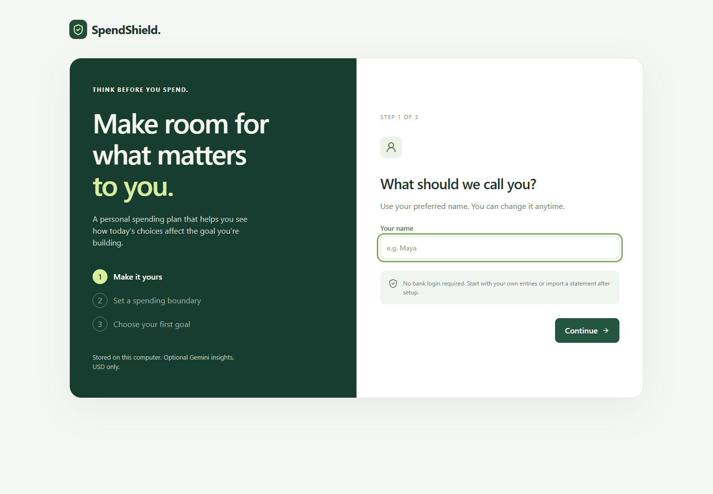

# SpendShield

SpendShield is a local, single-person spending planner. Set your own name, budget and savings goal, record real transactions, and understand a purchase before you commit to it. New installations start empty; no sample balances are mixed into your finances.

## Browser hosting with Gemini

A hosted mode is now included with GitHub sign-in, separate account databases, secure session cookies, and server-only Gemini credentials. GitHub Pages serves a redirect to the complete app on Render. See [HOSTING.md](HOSTING.md) for setup, costs, required private settings, and verification. No deployment has been performed yet. The local mode below remains available.

## Start using it

1. Open the app and complete the three short setup steps: preferred name, monthly discretionary budget and one savings goal. A budget or monthly savings contribution can be left blank and added later.
2. Choose **Add transaction** on Overview to record income or an expense. Or choose **Import CSV**, review the preview, then confirm the import.
3. Use **Purchase Shield** to enter a product and price. You can skip it, save the check for later, or enter the actual price of a cheaper alternative you found.
4. Those decisions become **planned savings**. In **Activity**, choose **Mark as saved** only after you have actually set the money aside. This increases your confirmed goal balance. SpendShield does not move money.
5. Use **Settings** (the gear at the top) to change your name, budget, goal or Gemini preference, or download your data. In Activity, edit or remove a transaction to correct a mistake.

All amounts are USD. Reporting uses today's date and the transactions you record, not a bank balance. Older imports remain in Activity but only transactions in the current month count toward current monthly totals. The dashboard reminds you to keep your entries complete.



Full instructions: [Feature guide](FEATURE-GUIDE.md). For a presentation walkthrough: [Judging guide](JUDGING-GUIDE.md).

## Features

- Three-step onboarding, personal name, editable settings and helpful empty states.
- Transaction entry, editing, removal and search; CSV preview and append with duplicate detection.
- Purchase checks with deterministic budget and goal calculations, optional Gemini text/image understanding, price confirmation and a persistent waiting list.
- A real-price alternative form instead of invented shopping recommendations.
- Separate planned and confirmed savings, with repeat-safe confirmation, unconfirmation and decision undo.
- Interactive price comparisons, target prices, custom 1-168 hour in-app reminders, searchable saved checks, archiving and restoration.
- Category suggestions require approval; backups can be previewed, restored and recovered.
- An in-app Guide explains every workflow and its limits.
- Spending patterns and recurring subscription detection; cancellations are recorded only after you cancel with the provider.
- Optional Gambling Guard with a voluntary weekly limit and cooling-off timer. It cannot block transactions or accounts.
- Data export, responsive desktop/mobile layouts, local SQLite persistence and server-side API credentials.

## Run on Windows

Requires Python 3.11+ and Node.js 20.19+. The validated environment uses Python 3.12, Node 24 and pnpm 11.

```powershell
python -m venv .venv
.\.venv\Scripts\python -m pip install -r requirements-lock.txt
cd frontend
pnpm install --frozen-lockfile
pnpm run build
cd ..
.\.venv\Scripts\python -m uvicorn backend.main:app --host 127.0.0.1 --port 8000
```

Open [SpendShield locally](http://127.0.0.1:8000). For subsequent launches, double-click `Start-SpendShield.cmd` on Windows, or run `.\.venv\Scripts\python start.py`. The launcher opens the app and reuses an already running SpendShield server. It serves both the built interface and API. Core features work without an API key.

On macOS/Linux, use `python3` and `.venv/bin/python`. The app itself is portable; the included browser-test launcher currently uses the Windows virtual-environment path.

For source development, `dev.py` starts the Python server and Vite on port 5173. If the managed Windows environment blocks Vite's optimizer, build the frontend and use port 8000 as above.

## Optional Gemini

Copy `.env.example` to `.env` at the repository root and set `GEMINI_API_KEY`. Restart the Python server, then opt in during setup or under Settings. Never put the key in frontend code or a `VITE_` variable. The local configured key is excluded from the source archive.

When enabled, requested AI features send relevant purchase/financial context or uploaded images to Google. Manual purchase calculations and rule-based scans work with AI turned off. Image reading needs a configured, available Gemini model. Extracted prices require confirmation before recording a decision.

The backend discovers supported models through `google-genai`, validates structured responses with Pydantic, and falls back to other discovered supported models on recoverable failures. An unavailable AI service is identified honestly; it does not stop manual entry. Model names shown on successful results identify the model actually used. `/api/gemini/status` indicates discovery availability, not a successful generation.

## CSV format

```csv
date,merchant,amount,category
2026-01-01,Salary,2500.00,Income
2026-01-02,Grocery store,-42.50,Groceries
2026-01-03,Cafe,-8.00,Restaurants
```

Required columns: `date`, `merchant`, `amount`. Category is optional. Dates are YYYY-MM-DD. Positive amounts are income; negative amounts are expenses/transfers. Refunds are not supported by this format. Files must be UTF-8, no more than 2 MB and 5,000 rows, with no future dates.

Categories: Income, Rent, Groceries, Restaurants, Transportation, Subscriptions, Entertainment, Shopping, Gambling, Savings, Other. Unknown expense categories become Other; you can correct them in Activity. An opted-in Gemini scan can classify ambiguous merchants, but changes are applied only after you select and approve the suggestions.

Imports preserve your profile, goal, decisions and existing transactions. Exact matches of date, case-insensitive merchant and amount are skipped, including duplicates within the upload. Add genuine identical purchases manually. Preview does not write data; the final import validates and deduplicates again inside a database transaction.

## What the numbers mean

- **Discretionary budget:** your monthly limit less recorded Restaurants, Entertainment, Shopping, Gambling and Other expenses. Rent, groceries, transport, subscriptions and savings transfers are excluded.
- **Savings rate:** recorded Savings transfers divided by recorded income for the month. It is separate from your goal balance.
- **Confirmed goal balance:** the balance you enter plus decisions you explicitly mark as saved. Editing the balance replaces the current confirmed total without counting existing confirmed decisions twice.
- **Planned savings / Money Rescued:** user-recorded avoided spending and cancelled recurring charges. These are intentions, not verified bank savings.
- **Goal projection:** remaining dollars divided by the monthly contribution, using a 30-day month and no investment return. Purchase impact assumes the purchase diverts money from that contribution. Extremely distant dates are omitted rather than causing an error.
- **Recurring charges:** one similarly sized subscription charge per month, 20-40 days apart, within the last 90 days. Annual savings projects confirmed cancellation amounts times 12; it does not annualize one-off purchase decisions.

Money is stored as integer cents. Decimal arithmetic controls ratios and rounding. AI does not calculate balances, goal dates or protected amounts.

## Data and deployment scope

This release is for **one person using it locally on their own computer**. SQLite is stored in `data/spendshield.sqlite3` (override with `SPENDSHIELD_DB`). Settings provides JSON backup export and restoration with a preview, explicit replacement confirmation, and one-step Undo last restore recovery. Restoring an imported backup turns Gemini off until you opt in again.

There is no online sign-in, multi-user isolation, bank connection, payment processing or automatic bank synchronization. Anyone able to access the running local app can see its profile. Keep the server bound to `127.0.0.1`; public service deployment requires a separate authentication, account isolation, hosting and operations implementation.

Upgrading a former synthetic session preserves a snapshot under `settings.previous_sample_backup` in SQLite before starting personal setup. Normal launches never seed sample transactions. The synthetic developer reset endpoint is disabled unless explicitly enabled with `SPENDSHIELD_ENABLE_DEMO=1`; it is not part of the interface.

## Verification

```powershell
.\.venv\Scripts\python -m pytest -q
.\.venv\Scripts\python -m ruff check backend
cd frontend
pnpm run lint
pnpm run build
pnpm run test:e2e
```

Browser tests run against a separate `data/e2e.sqlite3` database on port 8001, with Gemini disabled. They cover first setup, settings, entry/edit/persistence, planned-to-confirmed savings, import previews/deduplication and 320/390 px layouts. They never reset the personal database. Chrome is required for the configured browser channel.

In this managed environment, use a fresh writable `--basetemp` under the workspace and `-p no:cacheprovider` if pytest's default temporary directory is inaccessible. The sandbox can block Playwright's process-tree teardown; an explicitly started isolated test server can be reused and stopped afterward.

Latest verification (September 26, 2026): 52 backend tests and 11 browser journeys passed; Ruff, TypeScript, production build and ESLint passed. Live Gemini image understanding succeeded with gemini-3.1-flash-lite using a synthetic shopping image and synthetic context. Browser AI category review uses mocked responses; no personal financial records were used for live verification.

Hosted authentication tests additionally cover account isolation, session revocation, OAuth state/PKCE and replay prevention, request limits, upload limits, and fail-closed configuration. Provider sign-in uses a mocked identity response in automated tests; the real OAuth callback and Render deployment remain unverified until hosting is configured.
